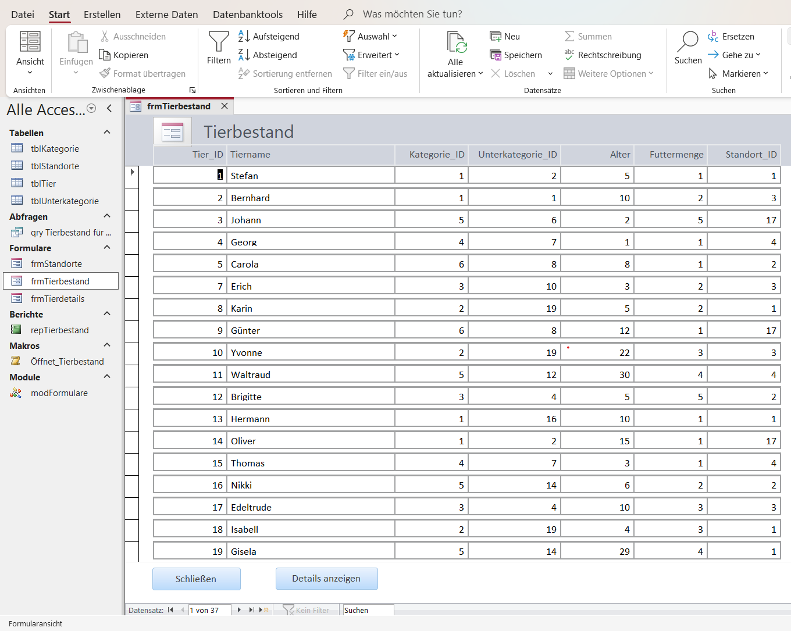

# Microsoft Access Database Development

A portfolio project demonstrating practical database development with Microsoft Access, VBA, SQL, and DAO.

## Project Overview

I implemented and extended a relational Microsoft Access database application for managing animal records.

The application includes interactive forms, record navigation, detail views, VBA event procedures, queries, and relational data structures.

In addition to the animal management application, this repository documents selected SQL and DAO exercises completed as part of my practical database development work.

The repository demonstrates my practical work with:

- Microsoft Access forms and controls
- VBA event-driven programming
- SQL queries
- DAO and Recordsets
- Relational tables and queries
- Record filtering and navigation

## Application Preview

The following screenshot shows the animal inventory form implemented in Microsoft Access. The form displays animal records and provides controls for closing the form and opening detailed information for the selected animal.



## Features

- Display and manage animal records
- Filter animals by location
- Count animals dynamically based on the selected animal shelter
- Display the number of records after applying or removing filters
- Open detailed information for a selected animal
- Display category, subcategory, and location names instead of numeric IDs
- Show animals belonging to the same subcategory
- Filter animals by maximum daily food consumption
- Reset filters and display all records
- Automate form behavior using VBA events

## Technologies Used

- Microsoft Access
- VBA (Visual Basic for Applications)
- SQL
- DAO (Data Access Objects)
- Relational Database Design
- Access Forms and Queries

## Example: Filtering Records with VBA

The following VBA procedure filters the displayed animals according to their maximum daily food consumption:

```vba
Private Sub cmdAnzeigen_Click()

    Me.Filter = "Futtermenge <= " & Me.txtFuttermenge
    Me.FilterOn = True

End Sub
```

The filter can be removed to display all animals again:

```vba
Private Sub cmdAlle_Click()

    Me.FilterOn = False

End Sub
```

## Database Concepts Implemented

The project uses relationships between several entities, including:

- Animals
- Categories
- Subcategories
- Locations

Queries are used to combine related data and display meaningful text values instead of database IDs.

## VBA and DAO

I implemented VBA event procedures to control form behavior and user interactions.

DAO recordsets were also used to work programmatically with database records, including:

- Navigating through records
- Counting records
- Reading field values
- Editing records
- Updating records

## SQL

The project includes SQL operations such as:

- `SELECT`
- `WHERE`
- `LIKE`
- `ORDER BY`
- `GROUP BY`
- `COUNT`
- `INNER JOIN`
- `INSERT INTO`
- `DELETE`

## Summary

I completed this project by combining database design, SQL queries, Access forms, DAO recordsets, and VBA event-driven programming into an interactive Microsoft Access application.
